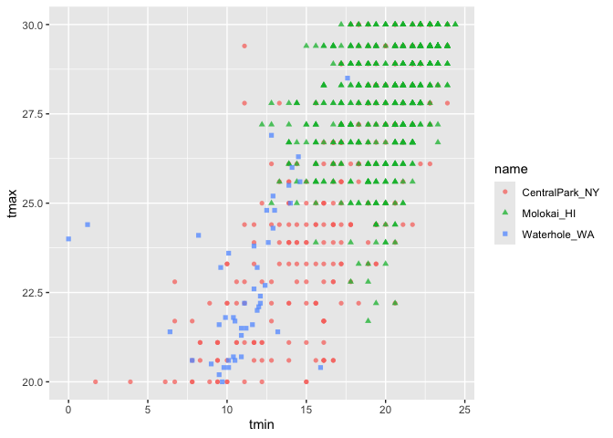

EDA
================
Kimberly Lopez
2024-10-03

``` r
library(tidyverse)
```

    ## ── Attaching core tidyverse packages ──────────────────────── tidyverse 2.0.0 ──
    ## ✔ dplyr     1.1.4     ✔ readr     2.1.5
    ## ✔ forcats   1.0.0     ✔ stringr   1.5.1
    ## ✔ ggplot2   3.5.1     ✔ tibble    3.2.1
    ## ✔ lubridate 1.9.3     ✔ tidyr     1.3.1
    ## ✔ purrr     1.0.2     
    ## ── Conflicts ────────────────────────────────────────── tidyverse_conflicts() ──
    ## ✖ dplyr::filter() masks stats::filter()
    ## ✖ dplyr::lag()    masks stats::lag()
    ## ℹ Use the conflicted package (<http://conflicted.r-lib.org/>) to force all conflicts to become errors

``` r
library ( patchwork)
library(haven)
```

Importing weather data

``` r
weather_df = 
  rnoaa::meteo_pull_monitors(
    c("USW00094728", "USW00022534", "USS0023B17S"),
    var = c("PRCP", "TMIN", "TMAX"), 
    date_min = "2021-01-01",
    date_max = "2022-12-31") |>
  mutate(
    name = case_match(
      id, 
      "USW00094728" ~ "CentralPark_NY", 
      "USW00022534" ~ "Molokai_HI",
      "USS0023B17S" ~ "Waterhole_WA"),
    tmin = tmin / 10,
    tmax = tmax / 10,
    month = lubridate::floor_date(date, unit = "month")) |>
  select(name, id, everything())
```

    ## using cached file: /Users/kimlopez/Library/Caches/org.R-project.R/R/rnoaa/noaa_ghcnd/USW00094728.dly

    ## date created (size, mb): 2024-09-26 10:19:32.377321 (8.651)

    ## file min/max dates: 1869-01-01 / 2024-09-30

    ## using cached file: /Users/kimlopez/Library/Caches/org.R-project.R/R/rnoaa/noaa_ghcnd/USW00022534.dly

    ## date created (size, mb): 2024-09-26 10:19:41.659463 (3.932)

    ## file min/max dates: 1949-10-01 / 2024-09-30

    ## using cached file: /Users/kimlopez/Library/Caches/org.R-project.R/R/rnoaa/noaa_ghcnd/USS0023B17S.dly

    ## date created (size, mb): 2024-09-26 10:19:44.798392 (1.036)

    ## file min/max dates: 1999-09-01 / 2024-09-30

## Initial numeric explorations

Before beginning to summarize data, it can help to use initial
visualizations to motivate some data checks or observations. Consider,
for example, this histogram of precipitation values:

``` r
weather_df |> 
  ggplot(aes(x = prcp)) + 
  geom_histogram()
```

    ## `stat_bin()` using `bins = 30`. Pick better value with `binwidth`.

    ## Warning: Removed 15 rows containing non-finite outside the scale range
    ## (`stat_bin()`).

<!-- -->

When was precipitation more than 1000

``` r
weather_df|> 
  filter(prcp>1000)
```

    ## # A tibble: 3 × 7
    ##   name           id          date        prcp  tmax  tmin month     
    ##   <chr>          <chr>       <date>     <dbl> <dbl> <dbl> <date>    
    ## 1 CentralPark_NY USW00094728 2021-08-21  1130  27.8  22.8 2021-08-01
    ## 2 CentralPark_NY USW00094728 2021-09-01  1811  25.6  17.2 2021-09-01
    ## 3 Molokai_HI     USW00022534 2022-12-18  1120  23.3  18.9 2022-12-01

A close look at the scatterplot below (which focuses on a range of
values to emphasize this point) suggests that Central Park and Molokai
report temperature values differently from Waterhole …

``` r
weather_df |> 
  filter(tmax >= 20, tmax <= 30) |> 
  ggplot(aes(x = tmin, y = tmax, color = name, shape = name)) + 
  geom_point(alpha = .75)
```

<!-- --> –\> there looks
like Central Park and Molokai has bands. This could be due to the way
the data is being reported. One might be reporting in fareheight and
other in degrees.

## group_by

Grouping weather data by name and month. This is different than
mutating.

- you can group by mutliple things

``` r
weather_df|> 
  group_by(name,month)
```

    ## # A tibble: 2,190 × 7
    ## # Groups:   name, month [72]
    ##    name           id          date        prcp  tmax  tmin month     
    ##    <chr>          <chr>       <date>     <dbl> <dbl> <dbl> <date>    
    ##  1 CentralPark_NY USW00094728 2021-01-01   157   4.4   0.6 2021-01-01
    ##  2 CentralPark_NY USW00094728 2021-01-02    13  10.6   2.2 2021-01-01
    ##  3 CentralPark_NY USW00094728 2021-01-03    56   3.3   1.1 2021-01-01
    ##  4 CentralPark_NY USW00094728 2021-01-04     5   6.1   1.7 2021-01-01
    ##  5 CentralPark_NY USW00094728 2021-01-05     0   5.6   2.2 2021-01-01
    ##  6 CentralPark_NY USW00094728 2021-01-06     0   5     1.1 2021-01-01
    ##  7 CentralPark_NY USW00094728 2021-01-07     0   5    -1   2021-01-01
    ##  8 CentralPark_NY USW00094728 2021-01-08     0   2.8  -2.7 2021-01-01
    ##  9 CentralPark_NY USW00094728 2021-01-09     0   2.8  -4.3 2021-01-01
    ## 10 CentralPark_NY USW00094728 2021-01-10     0   5    -1.6 2021-01-01
    ## # ℹ 2,180 more rows

We can use this to count stuff by using group and summarize.

- we can find distinct observations by adding a seperate variable that
  takes dictint(month).

``` r
weather_df|> 
  group_by(name)|> 
  summarize(
    n_obs = n(), 
    n_dist = n_distinct(month))
```

    ## # A tibble: 3 × 3
    ##   name           n_obs n_dist
    ##   <chr>          <int>  <int>
    ## 1 CentralPark_NY   730     24
    ## 2 Molokai_HI       730     24
    ## 3 Waterhole_WA     730     24

# 2x2 table

``` r
weather_df |> 
  drop_na(tmax) |> 
  mutate(
    cold = case_when(
      tmax <  5 ~ "cold",
      tmax >= 5 ~ "not_cold",
      TRUE      ~ ""
  )) |> 
  filter(name != "Molokai_HI") |> 
  group_by(name, cold) |> 
  summarize(count = n())
```

    ## `summarise()` has grouped output by 'name'. You can override using the
    ## `.groups` argument.

    ## # A tibble: 4 × 3
    ## # Groups:   name [2]
    ##   name           cold     count
    ##   <chr>          <chr>    <int>
    ## 1 CentralPark_NY cold        96
    ## 2 CentralPark_NY not_cold   634
    ## 3 Waterhole_WA   cold       319
    ## 4 Waterhole_WA   not_cold   395

We can turn this into a normal 2x2 table

``` r
weather_df |> 
  drop_na(tmax) |> 
  mutate(cold = case_when(
    tmax <  5 ~ "cold",
    tmax >= 5 ~ "not_cold",
    TRUE     ~ ""
  )) |> 
  filter(name != "Molokai_HI") |> 
  janitor::tabyl(name, cold)
```

    ##            name cold not_cold
    ##  CentralPark_NY   96      634
    ##    Waterhole_WA  319      395

## Generic numeric summaries

We can compute other general summary statistics like:

- after grouping by month, we are looking at all of these summaries for
  each month (3 stations for 24 months is 72 rows)
- summarize(), mean(), median(), var(), sd(), mad(), IQR(), min(), and
  max()
- use na.rm = TRUE if we have missing data

``` r
weather_df |>
  group_by(name, month) |>
  summarize(
    mean_tmax = mean(tmax, na.rm = TRUE),
    mean_prec = mean(prcp, na.rm = TRUE),
    median_tmax = median(tmax),
    sd_tmax = sd(tmax))
```

    ## `summarise()` has grouped output by 'name'. You can override using the
    ## `.groups` argument.

    ## # A tibble: 72 × 6
    ## # Groups:   name [3]
    ##    name           month      mean_tmax mean_prec median_tmax sd_tmax
    ##    <chr>          <date>         <dbl>     <dbl>       <dbl>   <dbl>
    ##  1 CentralPark_NY 2021-01-01      4.27      18.9         5      3.34
    ##  2 CentralPark_NY 2021-02-01      3.87      46.6         2.8    3.99
    ##  3 CentralPark_NY 2021-03-01     12.3       28.0        12.2    6.91
    ##  4 CentralPark_NY 2021-04-01     17.6       22.8        18.0    5.26
    ##  5 CentralPark_NY 2021-05-01     22.1       35.7        22.2    5.63
    ##  6 CentralPark_NY 2021-06-01     28.1       22.2        27.8    4.32
    ##  7 CentralPark_NY 2021-07-01     28.4       90.9        28.3    3.17
    ##  8 CentralPark_NY 2021-08-01     28.8       84.5        28.3    2.95
    ##  9 CentralPark_NY 2021-09-01     24.8       84.9        24.4    2.52
    ## 10 CentralPark_NY 2021-10-01     19.9       43.1        20.6    3.66
    ## # ℹ 62 more rows

This is still tidyverse stuff like a tibble.

Summarize and then plot this using ggplot since its a tibble.

``` r
weather_df |>
  group_by(name, month) |>
  summarize(
    mean_tmax = mean(tmax, na.rm = TRUE),
    mean_prec = mean(prcp, na.rm = TRUE),
    median_tmax = median(tmax),
    sd_tmax = sd(tmax)) |> 
  ggplot(aes(x = month, y = mean_tmax, color = name)) + 
    geom_point() + geom_line() + 
    theme(legend.position = "bottom")
```

    ## `summarise()` has grouped output by 'name'. You can override using the
    ## `.groups` argument.

<!-- -->

We can reformat this for it to be reader friendly. This time we only
focus on mean(tmax).

- sometimes this means making less tidy data (pivoting wider) to show
  whats going on in each
- still use knitr kable keeping only 3 digits

``` r
weather_df |>
  group_by(name, month) |>
  summarize(mean_tmax = mean(tmax, na.rm = TRUE)) |> 
  pivot_wider(
    names_from = name,
    values_from = mean_tmax) |> 
  knitr::kable(digits = 3, 
               col.names = c("Month", "Central Park", "Molokai", "Waterhole"))
```

    ## `summarise()` has grouped output by 'name'. You can override using the
    ## `.groups` argument.

| Month      | Central Park | Molokai | Waterhole |
|:-----------|-------------:|--------:|----------:|
| 2021-01-01 |        4.271 |  27.616 |     0.800 |
| 2021-02-01 |        3.868 |  26.368 |    -0.786 |
| 2021-03-01 |       12.294 |  25.861 |     2.623 |
| 2021-04-01 |       17.607 |  26.567 |     6.097 |
| 2021-05-01 |       22.084 |  28.577 |     8.203 |
| 2021-06-01 |       28.057 |  29.587 |    15.253 |
| 2021-07-01 |       28.352 |  29.994 |    17.335 |
| 2021-08-01 |       28.810 |  29.523 |    17.152 |
| 2021-09-01 |       24.787 |  29.673 |    12.647 |
| 2021-10-01 |       19.926 |  29.129 |     5.481 |
| 2021-11-01 |       11.537 |  28.847 |     3.533 |
| 2021-12-01 |        9.587 |  26.190 |    -2.097 |
| 2022-01-01 |        2.855 |  26.606 |     3.606 |
| 2022-02-01 |        7.650 |  26.829 |     2.989 |
| 2022-03-01 |       11.990 |  27.726 |     3.416 |
| 2022-04-01 |       15.810 |  27.723 |     2.463 |
| 2022-05-01 |       22.255 |  28.283 |     5.810 |
| 2022-06-01 |       26.090 |  29.157 |    11.127 |
| 2022-07-01 |       30.723 |  29.529 |    15.861 |
| 2022-08-01 |       30.500 |  30.697 |    18.830 |
| 2022-09-01 |       24.923 |  30.413 |    15.207 |
| 2022-10-01 |       17.426 |  29.223 |    11.884 |
| 2022-11-01 |       14.017 |  27.960 |     2.140 |
| 2022-12-01 |        6.761 |  27.348 |    -0.460 |

## Grouped Mutates

This groups by name first and then mutate the variable that takes the
mean of variable tmax and saved it to the new variable mean_tmax.

- \*\* do not group_by() permanantly\*\*
- we can also calc center by tmax- mean_tmax
- mutate is part of window functions which if u coonduct a whole
  function on a column it will return a column with the same amount of
  inputs the colomun had in it.

``` r
weather_df |>
  group_by(name) |>
  mutate(
    mean_tmax = mean(tmax, na.rm = TRUE),
    centered_tmax = tmax - mean_tmax)
```

    ## # A tibble: 2,190 × 9
    ## # Groups:   name [3]
    ##    name    id    date        prcp  tmax  tmin month      mean_tmax centered_tmax
    ##    <chr>   <chr> <date>     <dbl> <dbl> <dbl> <date>         <dbl>         <dbl>
    ##  1 Centra… USW0… 2021-01-01   157   4.4   0.6 2021-01-01      17.7        -13.3 
    ##  2 Centra… USW0… 2021-01-02    13  10.6   2.2 2021-01-01      17.7         -7.06
    ##  3 Centra… USW0… 2021-01-03    56   3.3   1.1 2021-01-01      17.7        -14.4 
    ##  4 Centra… USW0… 2021-01-04     5   6.1   1.7 2021-01-01      17.7        -11.6 
    ##  5 Centra… USW0… 2021-01-05     0   5.6   2.2 2021-01-01      17.7        -12.1 
    ##  6 Centra… USW0… 2021-01-06     0   5     1.1 2021-01-01      17.7        -12.7 
    ##  7 Centra… USW0… 2021-01-07     0   5    -1   2021-01-01      17.7        -12.7 
    ##  8 Centra… USW0… 2021-01-08     0   2.8  -2.7 2021-01-01      17.7        -14.9 
    ##  9 Centra… USW0… 2021-01-09     0   2.8  -4.3 2021-01-01      17.7        -14.9 
    ## 10 Centra… USW0… 2021-01-10     0   5    -1.6 2021-01-01      17.7        -12.7 
    ## # ℹ 2,180 more rows

Adding a ggplot to it

``` r
weather_df |>
  group_by(name) |>
  mutate(
    mean_tmax = mean(tmax, na.rm = TRUE),
    centered_tmax = tmax - mean_tmax) |> 
  ggplot(aes(x = date, y = centered_tmax, color = name)) + 
    geom_point() 
```

    ## Warning: Removed 17 rows containing missing values or values outside the scale range
    ## (`geom_point()`).

<!-- -->

Find Hottest or coldest days.

- coldest.
- we can use min_rank() or desc()

``` r
weather_df |> 
  group_by(name)|>
  mutate(
    temp_rank = min_rank(desc(tmax))
  )|> 
  filter(temp_rank<4)
```

    ## # A tibble: 16 × 8
    ## # Groups:   name [3]
    ##    name           id          date        prcp  tmax  tmin month      temp_rank
    ##    <chr>          <chr>       <date>     <dbl> <dbl> <dbl> <date>         <int>
    ##  1 CentralPark_NY USW00094728 2021-06-29     0  35    25.6 2021-06-01         3
    ##  2 CentralPark_NY USW00094728 2021-06-30   165  36.7  22.8 2021-06-01         1
    ##  3 CentralPark_NY USW00094728 2022-07-20     0  35    25.6 2022-07-01         3
    ##  4 CentralPark_NY USW00094728 2022-07-23     0  35    25.6 2022-07-01         3
    ##  5 CentralPark_NY USW00094728 2022-07-24     0  35    26.1 2022-07-01         3
    ##  6 CentralPark_NY USW00094728 2022-08-09     8  36.1  25.6 2022-08-01         2
    ##  7 Molokai_HI     USW00022534 2021-05-31     0  32.2  17.2 2021-05-01         2
    ##  8 Molokai_HI     USW00022534 2021-09-16     0  32.2  21.1 2021-09-01         2
    ##  9 Molokai_HI     USW00022534 2022-07-30     0  32.2  22.2 2022-07-01         2
    ## 10 Molokai_HI     USW00022534 2022-08-06     0  33.3  20.6 2022-08-01         1
    ## 11 Molokai_HI     USW00022534 2022-08-17     0  32.2  21.1 2022-08-01         2
    ## 12 Molokai_HI     USW00022534 2022-09-24     0  32.2  22.2 2022-09-01         2
    ## 13 Molokai_HI     USW00022534 2022-09-30     0  32.2  20   2022-09-01         2
    ## 14 Waterhole_WA   USS0023B17S 2021-06-27     0  28.5  17.6 2021-06-01         3
    ## 15 Waterhole_WA   USS0023B17S 2021-06-28     0  30.8  20.7 2021-06-01         2
    ## 16 Waterhole_WA   USS0023B17S 2021-06-29     0  32.4  17.6 2021-06-01         1

- we can also skip mutate() section and we can create the ranks and
  filter all in one shot.

``` r
weather_df|> 
  group_by(name)|>
  filter(min_rank(tmax) <4) |>
  arrange(tmax)
```

    ## # A tibble: 9 × 7
    ## # Groups:   name [3]
    ##   name           id          date        prcp  tmax  tmin month     
    ##   <chr>          <chr>       <date>     <dbl> <dbl> <dbl> <date>    
    ## 1 Waterhole_WA   USS0023B17S 2021-12-26   102 -11.4 -18.3 2021-12-01
    ## 2 Waterhole_WA   USS0023B17S 2021-12-27    25  -9.8 -19.6 2021-12-01
    ## 3 Waterhole_WA   USS0023B17S 2022-12-21     0  -9.6 -18.4 2022-12-01
    ## 4 CentralPark_NY USW00094728 2022-12-24     0  -9.3 -13.8 2022-12-01
    ## 5 CentralPark_NY USW00094728 2022-01-15     0  -6   -12.1 2022-01-01
    ## 6 CentralPark_NY USW00094728 2022-01-21     0  -5.5  -9.9 2022-01-01
    ## 7 Molokai_HI     USW00022534 2021-03-18   142  21.7  18.9 2021-03-01
    ## 8 Molokai_HI     USW00022534 2021-01-18   234  22.2  19.4 2021-01-01
    ## 9 Molokai_HI     USW00022534 2022-11-28    56  22.2  20.6 2022-11-01

We can use the Lad function used to compare an observation to it’s
previous value.

- useful, for example, to find the day-by-day change in max temperature
  within each station over the year

``` r
weather_df |>
  group_by(name) |>
  mutate(temp_change = tmax - lag(tmax))
```

    ## # A tibble: 2,190 × 8
    ## # Groups:   name [3]
    ##    name           id         date        prcp  tmax  tmin month      temp_change
    ##    <chr>          <chr>      <date>     <dbl> <dbl> <dbl> <date>           <dbl>
    ##  1 CentralPark_NY USW000947… 2021-01-01   157   4.4   0.6 2021-01-01      NA    
    ##  2 CentralPark_NY USW000947… 2021-01-02    13  10.6   2.2 2021-01-01       6.2  
    ##  3 CentralPark_NY USW000947… 2021-01-03    56   3.3   1.1 2021-01-01      -7.3  
    ##  4 CentralPark_NY USW000947… 2021-01-04     5   6.1   1.7 2021-01-01       2.8  
    ##  5 CentralPark_NY USW000947… 2021-01-05     0   5.6   2.2 2021-01-01      -0.5  
    ##  6 CentralPark_NY USW000947… 2021-01-06     0   5     1.1 2021-01-01      -0.600
    ##  7 CentralPark_NY USW000947… 2021-01-07     0   5    -1   2021-01-01       0    
    ##  8 CentralPark_NY USW000947… 2021-01-08     0   2.8  -2.7 2021-01-01      -2.2  
    ##  9 CentralPark_NY USW000947… 2021-01-09     0   2.8  -4.3 2021-01-01       0    
    ## 10 CentralPark_NY USW000947… 2021-01-10     0   5    -1.6 2021-01-01       2.2  
    ## # ℹ 2,180 more rows

DATA MUST BE IN ORDER, if we have missing dates we need to account for
that. This gives us day to day variations and fluctuations.

- group_by(name)
- mutate to create

``` r
weather_df |> 
  group_by(name)|>
  mutate (
    lagged_tmax = lag(tmax),
    temp_change = tmax - lagged_tmax)|>
  summarize ( 
    sd_tmax_change = sd(temp_change, na.rm=TRUE))
```

    ## # A tibble: 3 × 2
    ##   name           sd_tmax_change
    ##   <chr>                   <dbl>
    ## 1 CentralPark_NY           4.43
    ## 2 Molokai_HI               1.24
    ## 3 Waterhole_WA             3.04

## Revisiting Past Data

Use pulse dataframe, compute mean and median bdi_score for each visit in
a reader friendly format. Import
