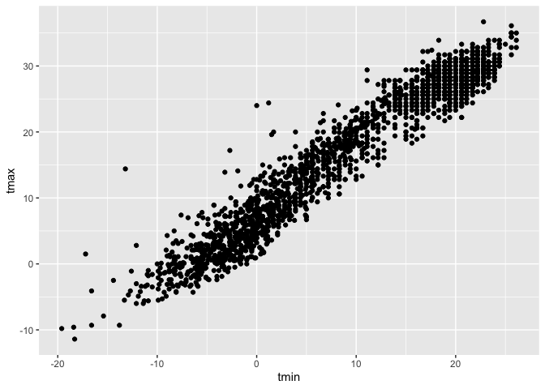

Visualization_1
================
Kimberly Lopez
2024-09-26

``` r
library(tidyverse)
```

    ## ── Attaching core tidyverse packages ──────────────────────── tidyverse 2.0.0 ──
    ## ✔ dplyr     1.1.4     ✔ readr     2.1.5
    ## ✔ forcats   1.0.0     ✔ stringr   1.5.1
    ## ✔ ggplot2   3.5.1     ✔ tibble    3.2.1
    ## ✔ lubridate 1.9.3     ✔ tidyr     1.3.1
    ## ✔ purrr     1.0.2     
    ## ── Conflicts ────────────────────────────────────────── tidyverse_conflicts() ──
    ## ✖ dplyr::filter() masks stats::filter()
    ## ✖ dplyr::lag()    masks stats::lag()
    ## ℹ Use the conflicted package (<http://conflicted.r-lib.org/>) to force all conflicts to become errors

Importing weather data.

- data is publicly avaialble
- rnoaa is allowing you to extract the data for the weathr stations &
  selectig data variables from 2021-2022
- mutating by creating a new variable “name” for case_matching and id
  and turning time into degrees celcious
- keeping id and everything else the same
- use df \|\> view() to view the df

``` r
weather_df = 
  rnoaa::meteo_pull_monitors(
    c("USW00094728", "USW00022534", "USS0023B17S"),
    var = c("PRCP", "TMIN", "TMAX"), 
    date_min = "2021-01-01",
    date_max = "2022-12-31") |>
  mutate(
    name = case_match(
      id, 
      "USW00094728" ~ "CentralPark_NY", 
      "USW00022534" ~ "Molokai_HI",
      "USS0023B17S" ~ "Waterhole_WA"),
    tmin = tmin / 10,
    tmax = tmax / 10) |>
  select(name, id, everything())
```

    ## using cached file: /Users/kimlopez/Library/Caches/org.R-project.R/R/rnoaa/noaa_ghcnd/USW00094728.dly

    ## date created (size, mb): 2024-09-26 10:19:32.377321 (8.651)

    ## file min/max dates: 1869-01-01 / 2024-09-30

    ## using cached file: /Users/kimlopez/Library/Caches/org.R-project.R/R/rnoaa/noaa_ghcnd/USW00022534.dly

    ## date created (size, mb): 2024-09-26 10:19:41.659463 (3.932)

    ## file min/max dates: 1949-10-01 / 2024-09-30

    ## using cached file: /Users/kimlopez/Library/Caches/org.R-project.R/R/rnoaa/noaa_ghcnd/USS0023B17S.dly

    ## date created (size, mb): 2024-09-26 10:19:44.798392 (1.036)

    ## file min/max dates: 1999-09-01 / 2024-09-30

# Basic Scatterplot

Making Plot 1 using ggplot.

- ggplot(dfname, aes(x = , y = ))
- this, alone, is a blank scatter plot becasue we have not stated the
  geometry yet
- use geom_point() to put the scatter plot points for this

``` r
 ggplot(weather_df, aes(x = tmin, y = tmax)) + 
  geom_point()
```

    ## Warning: Removed 17 rows containing missing values or values outside the scale range
    ## (`geom_point()`).

<!-- -->

You can also do this as part of a collection of other codes like piping

``` r
weather_df |> 
  ggplot(aes(x=tmin, y =tmax))+ 
  geom_point()
```

    ## Warning: Removed 17 rows containing missing values or values outside the scale range
    ## (`geom_point()`).

<!-- -->

Saving ggplot objects by assigning it to a variable
ggp_weather_scatterplot

``` r
ggp_weather_scatterplot= 
  weather_df |> 
  ggplot(aes(x=tmin, y =tmax))+ 
  geom_point()
```

We are getting warming message of missing values. Use filter function to
check which rows where there are missing data

``` r
weather_df |>
  filter(is.na(tmax))
```

    ## # A tibble: 17 × 6
    ##    name         id          date        prcp  tmax  tmin
    ##    <chr>        <chr>       <date>     <dbl> <dbl> <dbl>
    ##  1 Molokai_HI   USW00022534 2022-05-31    NA    NA    NA
    ##  2 Waterhole_WA USS0023B17S 2021-03-09    NA    NA    NA
    ##  3 Waterhole_WA USS0023B17S 2021-12-07    51    NA    NA
    ##  4 Waterhole_WA USS0023B17S 2021-12-31     0    NA    NA
    ##  5 Waterhole_WA USS0023B17S 2022-02-03     0    NA    NA
    ##  6 Waterhole_WA USS0023B17S 2022-08-09    NA    NA    NA
    ##  7 Waterhole_WA USS0023B17S 2022-08-10    NA    NA    NA
    ##  8 Waterhole_WA USS0023B17S 2022-08-11    NA    NA    NA
    ##  9 Waterhole_WA USS0023B17S 2022-08-12    NA    NA    NA
    ## 10 Waterhole_WA USS0023B17S 2022-08-13    NA    NA    NA
    ## 11 Waterhole_WA USS0023B17S 2022-08-14    NA    NA    NA
    ## 12 Waterhole_WA USS0023B17S 2022-08-15    NA    NA    NA
    ## 13 Waterhole_WA USS0023B17S 2022-08-16    NA    NA    NA
    ## 14 Waterhole_WA USS0023B17S 2022-08-17    NA    NA    NA
    ## 15 Waterhole_WA USS0023B17S 2022-08-18    NA    NA    NA
    ## 16 Waterhole_WA USS0023B17S 2022-08-19    NA    NA    NA
    ## 17 Waterhole_WA USS0023B17S 2022-12-31    76    NA    NA

# Advanced scatterplot

Use color in aes to assign the variables to a color - alpha makes points
more transparent in the geom_point changes are not specfiic to variables
so it aplies to the whole plot - geom_smooth creates a smooth line in
the points

**where you define the aesthetics matters**

``` r
ggplot(weather_df, aes(x = tmin, y = tmax, color= name)) + 
  geom_point(alpha = .3, size= .8) + 
  geom_smooth(se = FALSE)
```

    ## `geom_smooth()` using method = 'loess' and formula = 'y ~ x'

    ## Warning: Removed 17 rows containing non-finite outside the scale range
    ## (`stat_smooth()`).

    ## Warning: Removed 17 rows containing missing values or values outside the scale range
    ## (`geom_point()`).

<!-- --> Used
aes in the scatterplot from the whole plot, so then it creates a smooth
line to the whole plot

``` r
ggplot(weather_df, aes(x = tmin, y = tmax)) + 
  geom_point(aes(color = name), alpha = .5) +
  geom_smooth(se = FALSE)
```

    ## `geom_smooth()` using method = 'gam' and formula = 'y ~ s(x, bs = "cs")'

    ## Warning: Removed 17 rows containing non-finite outside the scale range
    ## (`stat_smooth()`).

    ## Warning: Removed 17 rows containing missing values or values outside the scale range
    ## (`geom_point()`).

<!-- -->

Use faceting to have 3 seperate scatter plots that are not overlaying on
each other. - left hand side is what variable we ave on the right hand
side placing columns first

``` r
weather_df |>
  ggplot(aes(x= tmin, y = tmax, color = name)) + 
  geom_point (alpha = .3) + 
  geom_smooth (se= FALSE) + 
  facet_grid(. ~ name)
```

    ## `geom_smooth()` using method = 'loess' and formula = 'y ~ x'

    ## Warning: Removed 17 rows containing non-finite outside the scale range
    ## (`stat_smooth()`).

    ## Warning: Removed 17 rows containing missing values or values outside the scale range
    ## (`geom_point()`).

<!-- -->

Plot using dates as the x-axis and y-amix to tmax to see seasonal trends
in all 3 locations. - setting size = prcp to show if it rained more on a
certain day the dots will be bigger

``` r
ggplot(weather_df, aes(x = date, y = tmax, color = name)) + 
  geom_point(aes(size = prcp), alpha = .5) +
  geom_smooth(se = FALSE) + 
  facet_grid(. ~ name)
```

    ## `geom_smooth()` using method = 'loess' and formula = 'y ~ x'

    ## Warning: Removed 17 rows containing non-finite outside the scale range
    ## (`stat_smooth()`).

    ## Warning: Removed 19 rows containing missing values or values outside the scale range
    ## (`geom_point()`).

<!-- -->

Write a code chain that starts with weather_df

- focuses only on Central Park (use filter())
- converts temperatures to Fahrenheit (temp \* (9/5)+32)
- makes a scatterplot of min vs. max temperature
- and overlays a linear regression line (using options in
  geom_smooth(method = “lm”))

``` r
weather_df |> 
  filter( name == "CentralPark_NY") |> 
  mutate(
    tmax_fahr= tmax * (9/5)+32, 
    tmin_fahr = tmin *(9/5)+32
  ) |>
ggplot(aes(x = tmin, y = tmax)) + 
  geom_point()+ 
  geom_smooth(method = "lm", se=FALSE) 
```

    ## `geom_smooth()` using formula = 'y ~ x'

<!-- -->
