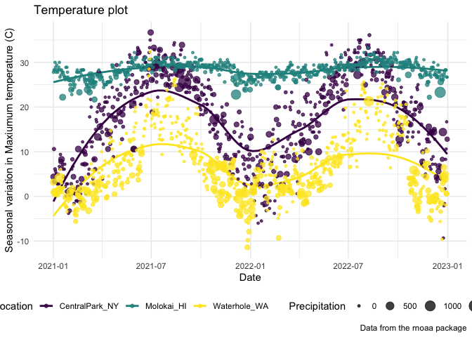

Visualization_2
================
Kimberly Lopez
2024-10-01

``` r
library(tidyverse)
```

    ## ── Attaching core tidyverse packages ──────────────────────── tidyverse 2.0.0 ──
    ## ✔ dplyr     1.1.4     ✔ readr     2.1.5
    ## ✔ forcats   1.0.0     ✔ stringr   1.5.1
    ## ✔ ggplot2   3.5.1     ✔ tibble    3.2.1
    ## ✔ lubridate 1.9.3     ✔ tidyr     1.3.1
    ## ✔ purrr     1.0.2     
    ## ── Conflicts ────────────────────────────────────────── tidyverse_conflicts() ──
    ## ✖ dplyr::filter() masks stats::filter()
    ## ✖ dplyr::lag()    masks stats::lag()
    ## ℹ Use the conflicted package (<http://conflicted.r-lib.org/>) to force all conflicts to become errors

``` r
library ( patchwork)
```

# Visualization 2

We’ll still work with NOAA weather data, which is loaded using the same
code as in Vis. 1

``` r
weather_df = 
  rnoaa::meteo_pull_monitors(
    c("USW00094728", "USW00022534", "USS0023B17S"),
    var = c("PRCP", "TMIN", "TMAX"), 
    date_min = "2021-01-01",
    date_max = "2022-12-31") |>
  mutate(
    name = case_match(
      id, 
      "USW00094728" ~ "CentralPark_NY", 
      "USW00022534" ~ "Molokai_HI",
      "USS0023B17S" ~ "Waterhole_WA"),
    tmin = tmin / 10,
    tmax = tmax / 10) |>
  select(name, id, everything())
```

    ## using cached file: /Users/kimlopez/Library/Caches/org.R-project.R/R/rnoaa/noaa_ghcnd/USW00094728.dly

    ## date created (size, mb): 2024-09-26 10:19:32.377321 (8.651)

    ## file min/max dates: 1869-01-01 / 2024-09-30

    ## using cached file: /Users/kimlopez/Library/Caches/org.R-project.R/R/rnoaa/noaa_ghcnd/USW00022534.dly

    ## date created (size, mb): 2024-09-26 10:19:41.659463 (3.932)

    ## file min/max dates: 1949-10-01 / 2024-09-30

    ## using cached file: /Users/kimlopez/Library/Caches/org.R-project.R/R/rnoaa/noaa_ghcnd/USS0023B17S.dly

    ## date created (size, mb): 2024-09-26 10:19:44.798392 (1.036)

    ## file min/max dates: 1999-09-01 / 2024-09-30

# Labels

Starting with scatterplot, but use labs function to label axis names

``` r
weather_df |> 
  ggplot(aes(x = tmin, y = tmax)) + 
  geom_point(aes(color = name), alpha = .5) + 
  labs(
    title = "Temperature plot",
    x = "Minimum daily temperature (C)",
    y = "Maxiumum daily temperature (C)",
    color = "Location",
    caption = "Weather data from the rnoaa package for three stations"
  )
```

    ## Warning: Removed 17 rows containing missing values or values outside the scale range
    ## (`geom_point()`).

<!-- -->

# Scales

Sometimes the default of ggplot scales this. Use scale_x_continous or
scale_y_discrete to set breaks = to a number. - you can transform the
data in the scale\_\* function - you can also set limits in this
function

``` r
weather_df |> 
  ggplot(aes(x = tmin, y = tmax)) + 
  geom_point(aes(color = name), alpha = .5) + 
  labs(
    title = "Temperature plot",
    x = "Minimum daily temperature (C)",
    y = "Maxiumum daily temperature (C)",
    color = "Location",
    caption = "Data from the rnoaa package") + 
  scale_x_continuous(
    breaks = c(-15, 0, 15), 
    labels = c("-15º C", "0", "15"),
     limits = c(-20, 30)) + 
   scale_y_continuous(
    trans = "sqrt", 
    position = "right")
```

    ## Warning in transformation$transform(x): NaNs produced

    ## Warning in scale_y_continuous(trans = "sqrt", position = "right"): sqrt
    ## transformation introduced infinite values.

    ## Warning: Removed 142 rows containing missing values or values outside the scale range
    ## (`geom_point()`).

<!-- -->

# Color in ggplot

Use scale_color_hue to make different color pallets. Dont make your own
color pallets ranges instead use set combinations viridis package

- here we ad to tell the scale_color_viridis function that discrete =
  TRUE.
- We used discrete = TRUE because the color aesthetic is mapped to a
  discrete variable.
- viridis::scale_fill_viridis() function is appropriate for the fill
  aesthetic used in histograms, density plots, and elsewhere.

``` r
ggp_temp_plot= 
  weather_df |> 
  ggplot(aes(x = tmin, y = tmax)) + 
  geom_point(aes(color = name), alpha = .5) + 
  labs(
    title = "Temperature plot",
    x = "Minimum daily temperature (C)",
    y = "Maxiumum daily temperature (C)",
    color = "Location",
    caption = "Data from the rnoaa package") + 
  scale_color_hue(h = c(100, 300))+ 
  viridis::scale_color_viridis(
    name = "Location", 
    discrete = TRUE
  )
```

    ## Scale for colour is already present.
    ## Adding another scale for colour, which will replace the existing scale.

# Themes

These control the overall appearance of the plots you are trying to make
which is not specific to aesthtic mapping. Were only changing how the
plots look in general.

- legend.position = “none” will remove the legend.

- theme_bw() will set background to white

- theme_minimal() is like the black and white

- theme_classic () gives you the lines of the bars

- order matters!!!!!

``` r
ggp_temp_plot + 
  theme_bw() +
  theme(legend.position = "bottom")
```

    ## Warning: Removed 17 rows containing missing values or values outside the scale range
    ## (`geom_point()`).

<!-- -->

``` r
ggp_temp_plot + 
  theme_classic() + 
  theme(legend.position = "bottom")
```

    ## Warning: Removed 17 rows containing missing values or values outside the scale range
    ## (`geom_point()`).

<!-- -->

Dont USe this:

``` r
ggp_temp_plot + 
  ggthemes::theme_excel() + 
  theme(legend.position = "bottom")
```

    ## Warning: Removed 17 rows containing missing values or values outside the scale range
    ## (`geom_point()`).

<!-- -->

A Good plot example:

Revisit the plot showing tmax against date for each location. Use
labels, scale options, and theme changes to improve the readability of
this plot steps - ggplot() - geom_smooth() standard error = false -
geom_point() to add the points - labs () labeling axis

``` r
weather_df|> 
  ggplot( aes(x = date, y = tmax, color = name)) + 
  geom_smooth(se = FALSE) + 
  geom_point(aes(size = prcp), alpha = .75) + 
  labs(
    title = "Temperature plot",
    x = "Date",
    y = "Seasonal variation in Maxiumum temperature (C)",
    color = "Location",
    caption = "Data from the rnoaa package", 
    size= "Precipitation"
  ) + 
  viridis::scale_color_viridis(discrete = TRUE) + 
  theme_minimal() + 
  theme(legend.position = "bottom")
```

    ## `geom_smooth()` using method = 'loess' and formula = 'y ~ x'

    ## Warning: Removed 17 rows containing non-finite outside the scale range
    ## (`stat_smooth()`).

    ## Warning: Removed 19 rows containing missing values or values outside the scale range
    ## (`geom_point()`).

<!-- -->

# Extra Bonus stuff in `ggplot`

Use different datasets in different `geom`s

Creating dataframes from locations central park, molokai. You dont
always have to put two dataframes in the same dataset to plot an
overlapping plot!!!

``` r
central_park_df = 
  weather_df |> 
  filter(name =="CentralPark_NY")

molokai_df = 
  weather_df |> 
  filter(name == "Molokai_HI")

molokai_df |> 
  ggplot(aes(x= date, y = tmax, color = name)) + 
  geom_point () + 
  geom_line(data = central_park_df)
```

    ## Warning: Removed 1 row containing missing values or values outside the scale range
    ## (`geom_point()`).

<!-- --> \##
Mulitple Panels

``` r
weather_df |> 
  ggplot(aes(x=tmax, fill = name))+ 
  geom_density() + 
  facet_grid(.~name)
```

    ## Warning: Removed 17 rows containing non-finite outside the scale range
    ## (`stat_density()`).

<!-- -->

Patching two seperate plots together when there are different plot
types.

- either paste two together: ggp_tmax_tmin + ggp_tmax_density OR

- put two plots together and one plot at the bottom: (ggp_tmax_tmin +
  ggp_tmax_density)/ ggp_tmax_date

``` r
ggp_tmax_tmin = 
  weather_df |> 
  ggplot(aes(x= tmin, y= tmax, color= name))+ 
  geom_point(alpha = .3) 

ggp_tmax_density = 
  weather_df |> 
  ggplot(aes(x= tmax, color= name))+ 
  geom_density(alpha = .3) 

ggp_tmax_date = 
  weather_df |> 
  ggplot(aes(x= date, y=tmax, color= name))+ 
  geom_point() + 
  geom_smooth(se=FALSE)

(ggp_tmax_tmin + ggp_tmax_density)/ ggp_tmax_date
```

    ## Warning: Removed 17 rows containing missing values or values outside the scale range
    ## (`geom_point()`).

    ## Warning: Removed 17 rows containing non-finite outside the scale range
    ## (`stat_density()`).

    ## `geom_smooth()` using method = 'loess' and formula = 'y ~ x'

    ## Warning: Removed 17 rows containing non-finite outside the scale range
    ## (`stat_smooth()`).

    ## Warning: Removed 17 rows containing missing values or values outside the scale range
    ## (`geom_point()`).

<!-- -->

# Setting options

set options to default. Use this at the beginning of the documents if
you want to set these preferences.

``` r
library(tidyverse)

knitr::opts_chunk$set(
  fig.width = 6,
  fig.asp = .6,
  out.width = "90%"
)

theme_set(theme_minimal() + theme(legend.position = "bottom"))

options(
  ggplot2.continuous.colour = "viridis",
  ggplot2.continuous.fill = "viridis"
)

scale_colour_discrete = scale_colour_viridis_d
scale_fill_discrete = scale_fill_viridis_d
```

## Data Manipulation

## Data argument in `geom_*`
